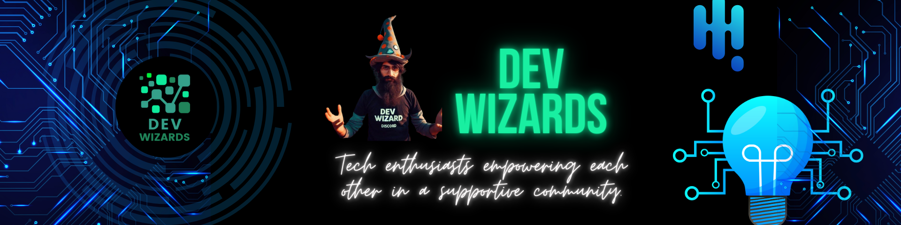

<section style="text-align:center" align="center">
    
</section>

# Welcome to Dev-Wizards!
_We're Tech enthusiasts empowering each other in a supportive community. Join us to learn, grow, and excel in the world of technology!_

We’re happy to have you here at **Dev-Wizards**, a community where coding magic happens! Our mission is to collaborate, learn, and grow together as developers. Whether you’re here to contribute, learn, or just explore, you’re in the right place.

> [!IMPORTANT]
> **"Community is much more than belonging to something; it’s about doing something together that makes belonging matter."**

### Code of Conduct

To ensure a positive experience for all members, please review our [Code of Conduct](https://dev-wizards.github.io/Code-of-Conduct/).

#### Contact Us

Have questions or need assistance? Reach out to us:

- **Email**: [devwizards.community@gmail.com](mailto:devwizards.community@gmail.com)
- **Discord**: [Join our server](https://discord.gg/mP8WuPVR2N)

Happy coding, and welcome to the magic of Dev-Wizards! 🚀